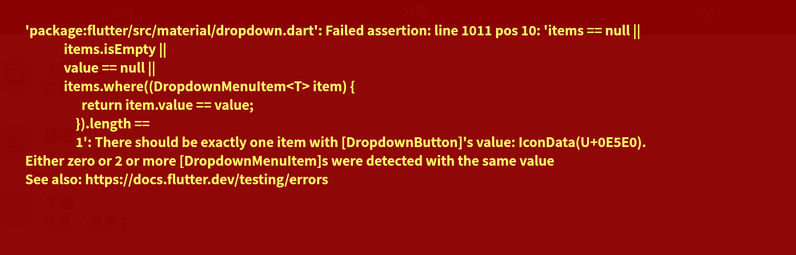

## 增加功能

增加webdav同步功能
增加一个atimelog_data下的local文件夹改名为current。
在根目录增加一个仅本地使用进行不同步的etag文件夹存储etag。
etag文件夹下有一个current_etag.json记录current文件夹的云端etag，还有etagdata文件夹，按分文件夹（按月份）存储对应的归档数据文件的etag数据，比如202512_etag.json记录202512文件夹下的etag数据。

更多界面的同步布局可以参考这个

可以设置webdav服务器的存储路径，可以验证服务器验证不检查同步仅是否能连同服务器，有手动同步按钮让用户进行手动同步，可以设置多少分钟进行同步一次。
平时主要在活动页面，所以在在活动页面增加一个小区域显示同步信息和一个手动同步按钮。启动和退出的时候自动进行一次同步。

下面是参考逻辑，应该只说了data文件夹同步，current文件夹也要同步，你完善一下逻辑然后实现。

### 一、 模块拆解 (Module Breakdown)

我们将系统依然分为三层，但重点增强了**目录管理**的能力。

#### 1. 网络层 (Network / WebDAV Layer)

_只负责“执行命令”，不负责“思考”。所有路径均为相对路径或完整 URL。_

- **`list_remote_subdirectories(root_path)`**
    
    - **功能**：列出云端 `data/` 下所有的月份文件夹。
        
    - **逻辑**：`PROPFIND (Depth: 1)` -> 筛选出 `resourcetype` 为 `collection` 的项目 -> 返回列表 `["202511", "202512", ...]`。
        
- **`fetch_folder_file_list(month_path)`**
    
    - **功能**：获取指定月份文件夹下所有文件的 ETag。
        
    - **逻辑**：`PROPFIND (Depth: 1)` -> 筛选出非文件夹的 `json` 文件 -> 返回 Map `{ "2025-12-05.json": "etag_123", ... }`。
        
- **`download_file(file_path)`**
    
    - **功能**：下载文件。
        
    - **输出**：返回对象 `{ content: String, etag: String }`。
        
    - **注意**：这里返回 ETag 是为了确保下载的那一瞬间文件的指纹，防止并发偏差。
        
- **`upload_file(file_path, content)`**
    
    - **功能**：上传文件。
        
    - **输出**：返回 `new_etag` (String)。
        
    - **关键**：WebDAV 的 `PUT` 响应头（Headers）里通常包含 `ETag`，直接解析并返回它。
        

#### 2. 本地层 (Local / IO Layer)

_负责磁盘读写和维护“元数据账本”。_

- **`get_local_month_folders()`**
    
    - **功能**：扫描本地 `data/` 目录，返回存在的月份文件夹列表 `["202511", "202512"]`。
        
- **`get_local_files_in_month(month)`**
    
    - **功能**：返回该文件夹下实际存在的 JSON 文件名列表。
        
- **`read_local_file_timestamp(relative_path)`**
    
    - **功能**：读取文件内容，解析 `lastUpdated` 字段并返回。
        
- **`update_sync_meta(relative_path, new_etag)`**
    
    - **功能**：更新本地的 `sync_meta.json`。
        
    - **逻辑**：推荐 Key 使用相对路径，如 `"202512/2025-12-05.json": "etag_value"`，这样全局唯一。
        
- **`get_cached_etag(relative_path)`**
    
    - **功能**：从 `sync_meta.json` 读取缓存的 ETag。
        

#### 3. 业务逻辑层 (Sync Orchestrator)

_负责指挥。核心变化在于增加了“外层循环”。_

---

### 二、 核心同步逻辑流程

我们将逻辑分为 **3 个原子操作** 和 **1 个主循环**。

#### 💡 原子操作 A：`action_download_overwrite(path)`

_当决定“云端覆盖本地”时调用。_

1. **网路**：调用 `download_file(path)`，拿到 `content` 和 `remote_etag`。
    
2. **本地**：写入 `content` 到磁盘。
    
3. **本地**：调用 `update_sync_meta(path, remote_etag)`。**（直接写入，不查询）**
    
4. **结束**。
    

#### 💡 原子操作 B：`action_upload_overwrite(path)`

_当决定“本地覆盖云端”或“上传新文件”时调用。_

1. **本地**：读取文件 `content`。
    
2. **网络**：调用 `upload_file(path, content)`。
    
    - _WebDAV 响应会返回新的 ETag。_
        
3. **本地**：拿到返回的 ETag，调用 `update_sync_meta(path, new_etag)`。**（直接写入，不查询）**
    
4. **结束**。
    

#### 💡 原子操作 C：`action_resolve_conflict(path, remote_etag)`

_当本地有文件但 ETag 不一致时调用。_

1. **网络**：`download_file(path)` -> 拿到 `cloud_content`。
    
2. **解析**：
    
    - `cloud_ts` = 解析 `cloud_content` 的 `lastUpdated`。
        
    - `local_ts` = 调用本地层 `read_local_file_timestamp`。
        
3. **裁判**：
    
    - **Cloud > Local (云端新)**：执行 **原子操作 A**。
        
    - **Local > Cloud (本地新)**：执行 **原子操作 B**。
        
    - **Equal (相等)**：说明内容其实一样，仅更新本地 meta：`update_sync_meta(path, remote_etag)`。
        

---

### 三、 完整同步主流程 (Master Routine)

这是你每次点击“同步”按钮时运行的逻辑：

**步骤 1：构建月份集合 (Discovery)**

- `remote_months` = 网络层.`list_remote_subdirectories()`
    
- `local_months` = 本地层.`get_local_month_folders()`
    
- `all_months` = `remote_months` 和 `local_months` 的并集 (Set Union)。
    
    - _目的：防止漏掉“云端有但本地没有的月份”或者“本地新建但云端没有的月份”。_
        

**步骤 2：遍历月份 (Outer Loop)**

- **FOR EACH** `month` **IN** `all_months`:
    
    - **2.1 准备数据**
        
        - `remote_files_map` = 网络层.`fetch_folder_file_list(month)` (获取该月所有云端文件名和ETag)
            
        - `local_files_list` = 本地层.`get_local_files_in_month(month)` (获取该月所有本地文件名)
            
        - `path_prefix` = `month + "/"` (例如 "202512/")
            
    - **2.2 遍历云端列表 (处理 下载 & 冲突)**
        
        - **FOR EACH** `filename, cloud_etag` **IN** `remote_files_map`:
            
            - `full_path` = `path_prefix + filename`
                
            - `cached_etag` = 本地层.`get_cached_etag(full_path)`
                
            - **IF** (本地没有这个文件):
                
                - 执行 **原子操作 A (下载)**。
                    
            - **ELSE IF** (`cached_etag` != `cloud_etag`):
                
                - 执行 **原子操作 C (冲突解决)**。
                    
            - **ELSE**:
                
                - ETag 一致，跳过。
                    
    - **2.3 遍历本地列表 (处理 纯上传)**
        
        - **FOR EACH** `filename` **IN** `local_files_list`:
            
            - **IF** (该文件名 不在 `remote_files_map` 中):
                
                - `full_path` = `path_prefix + filename`
                    
                - 执行 **原子操作 B (上传)**。
                    

**步骤 3：收尾**

- 将内存中更新过的 `sync_meta` 持久化保存到 json 文件。
    
- UI 提示“同步完成”。
